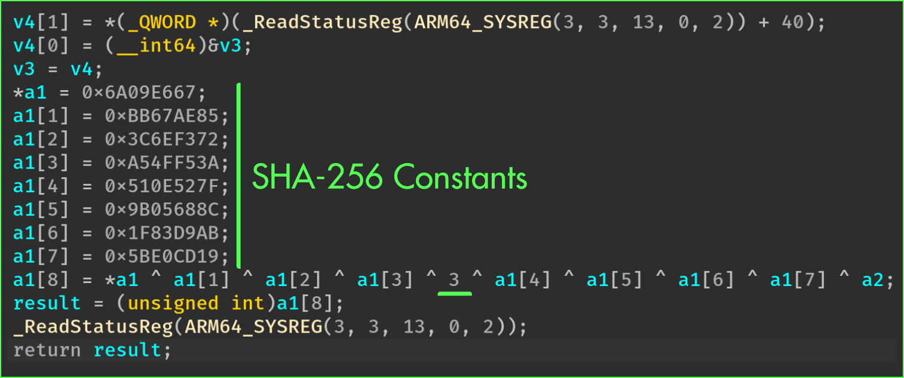

+++
title       = "Opaque Constants"
description = "This pass can be used to obfuscate constants"
icon        = "fa-regular fa-input-numeric"
img_compare = true
+++

Opaque Constants


The purpose of this pass is to protect constants using opaque values




While reverse engineering binary, clear strings, symbols, and integer constants are important information
that is used to quickly infer the purpose of a function.

This pass protects integer constants by using opaque operations.

## When to use it?

You should use it if your function is using integer constants that characterizes its logic. This is particularly
true for cryptographic and encoding functions.

You could also trigger this pass to add another layer of protection on a sensitive function, even though
the constants of the function are not sensitive.

## How to use it?

As for the other passes, this protection can be enabled by defining the function `obfuscate_constants`
in the class that inherits from `omvll.ObfuscationConfig`:

```python {hl_lines=2}
class Config(omvll.ObfuscationConfig):
    def obfuscate_constants(self, mod: omvll.Module, func: omvll.Function):
        # Logic goes here
```

The returned values of this method depend on which constants should be protected.
Let's take a real example with the SHA-256 initialization routine. Usually, this routine
initializes a buffer with the SHA-256 constants. For instance, in mbedtls it is implemented as follows:

```cpp
int mbedtls_sha256_starts(mbedtls_sha256_context *ctx, int is224) {
  if (!is224) {
    /* SHA-256 */
    ctx->state[0] = 0x6A09E667;
    ctx->state[1] = 0xBB67AE85;
    ctx->state[2] = 0x3C6EF372;
    ctx->state[3] = 0xA54FF53A;
    ctx->state[4] = 0x510E527F;
    ctx->state[5] = 0x9B05688C;
    ctx->state[6] = 0x1F83D9AB;
    ctx->state[7] = 0x5BE0CD19;
  }
}
```

For the purpose of this documentation, let's slightly modify this routine:

```cpp
uint32_t init_context_all(context_t& ctx, uint32_t secret) {
  ctx.state[0] = 0x6A09E667;
  ctx.state[1] = 0xBB67AE85;
  ctx.state[2] = 0x3C6EF372;
  ctx.state[3] = 0xA54FF53A;
  ctx.state[4] = 0x510E527F;
  ctx.state[5] = 0x9B05688C;
  ctx.state[6] = 0x1F83D9AB;
  ctx.state[7] = 0x5BE0CD19;
  ctx.result = ctx.state[0] ^ ctx.state[1] ^ ctx.state[2] ^ ctx.state[3] ^ 0x03 ^
               ctx.state[4] ^ ctx.state[5] ^ ctx.state[6] ^ ctx.state[7] ^ secret;
  return ctx.result;
}
```

Once compiled, this function looks like this in a decompiler:



From this output, we can clearly identify the initialization constants.


From a reverse engineering perspective, this initialization routine is usually enough to completely
reverse the other functions associated with the crypto/hash algorithm.<br /><br />

Indeed, most of the cryptographic libraries follow this pattern for a given algorithm:

1. `init()`
2. `update()`
3. `finalize()`

Therefore, using cross-references, a reverse engineer could easily identify the other functions (update, finalize, ...)


To protect **all the constants**, we can return `True` from the configuration callback:

```python {hl_lines=4}
class Config(omvll.ObfuscationConfig):
    def obfuscate_constants(_, __, func: omvll.Function):
        if "init_context_all" in func.demangled_name:
            return True
        return False
```

And `False` for none of them. As a result, here are the differences before and after enabling the pass:



We might also want to only protect **a subset** of constants. In that case,
we can return a **lower limit** for which only the constants above this limit will be obfuscated:

```python {hl_lines="4-5"}
class Config(omvll.ObfuscationConfig):
    def obfuscate_constants(_, __, func: omvll.Function):
        if "init_context_all" in func.demangled_name:
            # Obfuscate the constants that are greater (strict) than 3
            return omvll.OpaqueConstantsLowerLimit(3)
        return False
```

With such a configuration, the constants below or equal to **3** are **not** obfuscated:



Finally, the function can also return **a list of constants** that must be obfuscated:

```python {hl_lines="4-5"}
class Config(omvll.ObfuscationConfig):
    def obfuscate_constants(_, __, func: omvll.Function):
        if "init_context_all" in func.demangled_name:
            # Only obfuscate the constants that are in this list
            return [0x510E527F, 0x9B05688C, 0x1F83D9AB, 0x5BE0CD19]
        return False
```

## Implementation

This pass works by iterating over all the instruction's operands and by checking if it is a constant:

```cpp {hl_lines="5-6"}
for (Function& F : M) {
  for (BasicBlock& BB : F) {
    for (Instruction& I : BB) {
      for (Use& Op : I.operands()) {
        if (auto* CI = dyn_cast<ConstantInt>(Op)) {
          Process(I, Op, *CI, opt);
} } } } }
```

Upon a constant, the pass generates the same constant under an opaque form:

###### Opaque Zero

The pass generates an opaque zero value as follows:

```python
0 == MBA(X ^ Y)        - (X ^ Y)
0 == (X | Y) - (X & Y) - (X ^ Y)
```

###### Opaque One

Opaque 1 leverages the fact that the stack is aligned, which means that the lower bits are set to 0:

```python
LSB = LSB(stack address)
Odd = random_odd()

1 == (LSB + Odd) % 2
```

###### Opaque Value

To obfuscate a random constant that is not 0 or 1, the pass randomly splits the constant
in two parts:

```cpp
uint64_t Val = CST; // <--- To protect

uint8_t Split = random(1, min(255, Val));

uint64_t LHS = Val - Split; // Part 1
uint64_t RHS = Split;       // Part 2
```

Then, the pass generates IR instructions to reconstruct the original value. This
reconstruction is essentially an addition between `LHS` and `RHS` and to prevent
a "constant propagation", it uses two intermediate variables:

1. `__omvll_opaque_gv`
2. `__omvll_opaque_stack_allocated`

The pass also adds an opaque zero using the lower bits of the stack address. In the end,
the transformation of the constant looks like this:

```cpp
static uint64_t __omvll_opaque_gv;

void function() {
  uint64_t __omvll_opaque_stack_allocated;
  __omvll_opaque_gv              = LHS;
  __omvll_opaque_stack_allocated = RHS;

  __omvll_opaque_gv              += OpaqueZero(0);
  __omvll_opaque_stack_allocated += OpaqueZero(0);

  // The original value:
  uint64_t Val = __omvll_opaque_gv + __omvll_opaque_stack_allocated;
}
```

## Limitations

In its current form, the opaque values are generated with the **same** transformation. Hence, if an attacker
manages to automate the deobfuscation, the attack scales easily.

If the reverse engineering tools (IDA, BinaryNinja, ...) introduce *assumption* about lower bits of the
stack, it could also threaten the pass.
